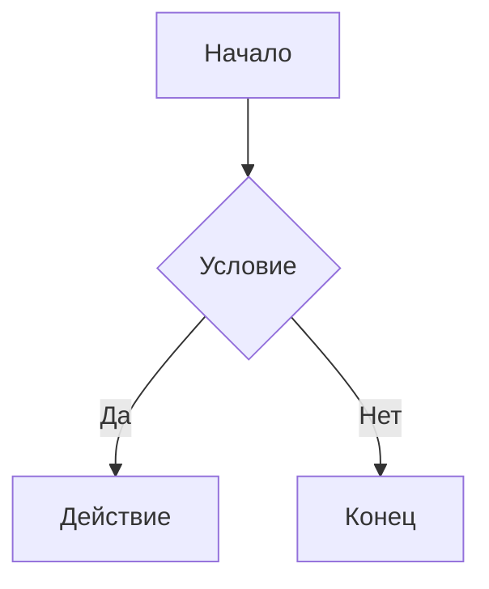
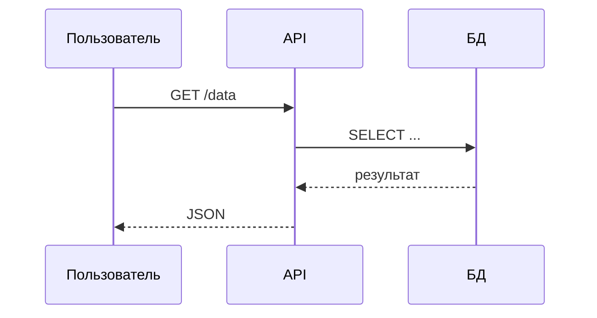
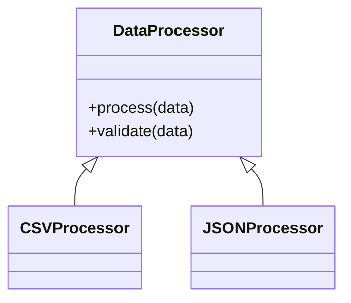
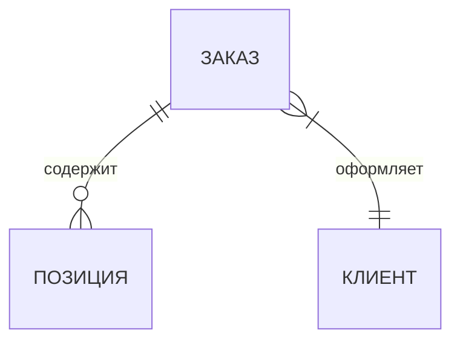

# Методология написания MD-файлов для ГОСТ-транспилятора

Данный документ описывает **точный синтаксис** Markdown-файлов, которые корректно
транспилируются в DOCX, соответствующий требованиям ГОСТ (КубГУ, 2019 / ГОСТ 7.32-2017).

---

## 1. Структура файла

### 1.1 YAML-шапка (frontmatter)

Каждый MD-файл ДОЛЖЕН начинаться с YAML-шапки. Она не попадает в документ — нужна только
как метаданные.

```yaml
---
type: vkr          # vkr | kursovaya | diplomnaya | magisterskaya | nir
title: Название работы
author: Фамилия Имя Отчество
year: 2024
---
```

### 1.2 Порядок структурных элементов

Структурные элементы **ОБЯЗАТЕЛЬНО** идут в следующем порядке:

```
# СОДЕРЖАНИЕ           ← генерирует поле TOC; с новой страницы
# ВВЕДЕНИЕ             ← с новой страницы
# 1 Раздел один        ← с новой страницы
## 1.1 Подраздел
### 1.1.1 Пункт
#### 1.1.1.1 Подпункт
# 2 Раздел два         ← с новой страницы
...
# ЗАКЛЮЧЕНИЕ           ← с новой страницы
# СПИСОК ИСПОЛЬЗОВАННЫХ ИСТОЧНИКОВ   ← с новой страницы
# ПРИЛОЖЕНИЕ А         ← с новой страницы
> Название приложения  ← заголовок приложения (с прописной)
# ПРИЛОЖЕНИЕ Б
> Название второго приложения
...
```

---

## 2. Заголовки

### 2.1 Структурные заголовки (ALL CAPS, по центру)

Используйте `#` с ПРОПИСНЫМИ буквами для структурных элементов:

```markdown
# ВВЕДЕНИЕ
# ЗАКЛЮЧЕНИЕ
# СПИСОК ИСПОЛЬЗОВАННЫХ ИСТОЧНИКОВ
# РЕФЕРАТ
```

**Правило:** После заголовка обязательна пустая строка перед первым абзацем.

### 2.2 Нумерованные разделы

```markdown
# 1 Теоретические основы

## 1.1 Первый подраздел

### 1.1.1 Первый пункт

#### 1.1.1.1 Первый подпункт
```

**Правила:**
- Номер и текст разделяются пробелом: `# 1 Название`
- Точка после номера НЕ ставится: ~~`# 1. Название`~~ → НЕПРАВИЛЬНО
- Перенос слов в заголовках ЗАПРЕЩЁН — пишите заголовки в одну строку
- Раздел 1-го уровня всегда начинается с новой страницы (автоматически)
- После заголовка — пустая строка

### 2.3 Заголовок приложения

```markdown
# ПРИЛОЖЕНИЕ А

> Название приложения с прописной буквы

Текст приложения...
```

- Буквы приложений: А, Б, В, Г, Д, Е, Ж, И, К, Л, М, Н, П, Р, С, Т, У, Ф, Х, Ц, Ш, Щ, Э, Ю, Я
  (буквы Ё, З, Й, О, Ч, Ъ, Ы, Ь — НЕ используются)
- После исчерпания русских букв: A, B, C, D, E, F, G, H, J, K... (без I и O)

---

## 3. Текстовые абзацы

Каждый абзац — это один или несколько объединённых строк без пустых строк между ними.
Пустая строка = конец абзаца.

```markdown
Это первый абзац. Он может занимать несколько
строк без пустых строк между ними — всё это один абзац.

Это второй абзац (после пустой строки).
```

**Форматирование текста:**

| Синтаксис | Результат | Когда использовать |
|-----------|-----------|-------------------|
| `**текст**` | жирный | ❌ ЗАПРЕЩЕНО в теле работы — только в заголовках |
| `*текст*` | курсив | Термины, названия объектов, определения (первое упоминание) |
| `` `код` `` | моноширинный | Имена переменных, программный код, команды |
| `[14]` | [14] | Затекстовая ссылка |
| `[14, с. 25]` | [14, с. 25] | Ссылка с указанием страницы |
| `$символ$` | формульный объект Word (OMML, редактируется в Word) | Математические переменные в тексте |

> **❌ ЖИРНЫЙ ШРИФТ В ТЕКСТЕ ЗАПРЕЩЁН.**
> Согласно ГОСТ 7.32-2017 и методическим указаниям КубГУ, жирное начертание (`**...**`)
> допустимо исключительно в заголовках разделов. В теле работы — абзацах, списках,
> подписях к таблицам и рисункам — `**...**` не используется. Выделение мысли достигается
> через курсив (`*...*`) или структуру предложения.

**Тире в тексте:** используйте `–` (среднее тире, U+2013) для пауз в предложениях, диапазонов и определений.
Транспилятор автоматически заменяет `—` (длинное тире, U+2014) на `–` везде в тексте.

**Математика:** `$...$` и `$$...$$` конвертируются в нативные Word Math объекты (OMML), размер шрифта 14 пт.
Формулы редактируемы в Word через встроенный редактор уравнений.

**⚠ ВАЖНО:** Согласно ГОСТ, в тексте (вне таблиц) НЕЛЬЗЯ использовать:
- Знак `–` перед отрицательными числами → писать слово «минус»: `минус 5`
- Знак `⌀` для диаметра → писать слово «диаметр»
- Знаки `<`, `>`, `=`, `≠`, `≤`, `≥` без числовых значений → писать словами
- Знак `№` → писать «номер»
- Знак `%` без числа → писать «процент»
- Числа от 1 до 9 без единиц измерения → писать словами: «три образца», «пять групп»

---

## 4. Списки перечислений

### 4.1 Список с тире (основной)

```markdown
Текст перед списком:

- первый элемент перечисления;
- второй элемент перечисления;
- третий элемент перечисления.
```

**Правила:**
- Используйте `-` (дефис) — транспилятор заменит на `–` (тире)
- После каждого элемента кроме последнего — точка с запятой `;`
- После последнего элемента — точка `.`
- Строчная буква в начале каждого элемента
- Если элемент — законченное предложение → точка в конце и прописная буква

### 4.2 Список с буквенной нумерацией

```markdown
а) первый подпункт;
б) второй подпункт;
в) третий подпункт.
```

### 4.3 Вложенный список с цифрами

```markdown
а) первый пункт:
1) первый подпункт;
2) второй подпункт;
б) второй пункт.
```

---

## 5. Таблицы

### 5.1 Синтаксис

Подпись таблицы ставится ВЫШЕ таблицы в формате HTML-комментария:

```markdown
<!-- Таблица 2.1 – Название таблицы -->
| Заголовок столбца 1 | Заголовок столбца 2 | Заголовок столбца 3 |
|---------------------|---------------------|---------------------|
| Данные 1            | Данные 2            | Данные 3            |
| Данные 4            | Данные 5            | –                   |
```

Или через именованную строку перед таблицей:

```markdown
Таблица 3.2 – Динамика основных показателей
| Показатель | 2021 | 2022 | 2023 |
|------------|------|------|------|
| ВВП, млрд  | 120  | 135  | 148  |
```

### 5.2 Правила нумерации таблиц

- **Сквозная нумерация** (простые работы): `Таблица 1 – Название`
- **В пределах раздела** (рекомендуется): `Таблица 2.1 – Название`
  (первая цифра = номер раздела, вторая = порядковый номер таблицы в разделе)

Подпись таблицы генерируется шрифтом **14 пт** (Times New Roman), как и основной текст.

### 5.3 Правила оформления данных в таблице

| Ситуация | Что писать |
|----------|-----------|
| Данные отсутствуют | `–` (тире) |
| Повторяющееся одно слово | `«То же»` (для многословных) или `»` |
| Нет данных | `–` |
| Ограничение «не более» | Пишите в заголовке столбца |

### 5.4 Ссылка на таблицу в тексте

```markdown
Данные приведены в таблице 2.1.
(см. таблицу 3.2)
```

---

## 6. Рисунки и иллюстрации

### 6.1 Синтаксис

```markdown

```

Транспилятор автоматически:
- Добавляет подпись «Рисунок N – Название» НИЖЕ рисунка
- Нумерует рисунки сквозно или по разделам

**В приложениях** нумерация автоматически меняется: `Рисунок А.1 – Название`

### 6.2 Правила

- Путь к файлу — относительный от расположения MD-файла
- Если файл не найден — вставляется заглушка `[Рисунок: путь]`
- Форматы: PNG, JPG, SVG
- Рисунок центрируется, ширина ≤ 15,5 см

### 6.3 Ссылка на рисунок в тексте

```markdown
(см. рисунок 2.1)
в соответствии с рисунком 3
```

### 6.4 Диаграммы Mermaid

Вместо подготовки файла изображения заранее можно описать диаграмму прямо в MD-файле с помощью синтаксиса Mermaid. Транспилятор отрендерит её в PNG и вставит как рисунок с ГОСТ-подписью.

**Синтаксис:**

````markdown

````

Текст после слова `mermaid` в открывающей строке блока становится подписью рисунка: `Рисунок N – Описание диаграммы`.

**Правила:**

- Описание (alt-текст) обязательно — пишется через пробел после слова `mermaid`
- Код диаграммы — стандартный синтаксис Mermaid (flowchart, sequenceDiagram, classDiagram, gantt, erDiagram и др.)
- Нумерация и оформление — те же, что у обычных рисунков; в приложениях: `Рисунок А.1 – Описание`
- Если рендеринг недоступен — вставляется заглушка `[Диаграмма: Описание]`

**Рендеринг (приоритет):**

1. `mmdc` — Mermaid CLI (`npm install -g @mermaid-js/mermaid-cli`); требует Node.js
2. `kroki.io` — HTTP API, резервный вариант при наличии интернета
3. Заглушка — если ни один из вариантов недоступен

**Примеры поддерживаемых диаграмм:**

````markdown

````

````markdown

````

````markdown

````

### 6.5 Ссылки на Mermaid-диаграммы в тексте

Ссылки оформляются так же, как на обычные рисунки:

```markdown
(см. рисунок 2.3)
на рисунке 3 представлена схема
```

---

## 7. Листинги программного кода

Для работ в области информационных технологий ГОСТ 7.32-2017 прямо не регламентирует оформление листингов, однако допускает «использование компьютерных возможностей для акцентирования внимания... применяя шрифты разной гарнитуры» (п. 3.1 методических указаний КубГУ). Листинги оформляются моноширинным шрифтом и визуально отделяются от основного текста.

### 7.1 Синтаксис блока кода

Используйте три обратных кавычки с названием языка (опционально):

````markdown
```python
def hello():
    print("Hello, world!")
```
````

````markdown
```typescript
const x: number = 42;
```
````

````markdown
```
# блок без указания языка
SELECT * FROM users;
```
````

**Правила:**
- Открывающая строка: ` ``` ` или ` ```язык ` (без пробелов перед ```)
- Закрывающая строка: ровно ` ``` ` (без других символов)
- Перед и после блока — пустая строка
- Название языка (если указано) не попадает в документ — используется только как метка

### 7.2 Оформление в DOCX

Транспилятор автоматически:
- Применяет шрифт **Courier New, 12 пт** (моноширинный)
- Выравнивает по левому краю, без абзацного отступа первой строки
- Устанавливает отступ слева 1,25 см (уровень абзаца)
- Добавляет светло-серый фон (#F2F2F2) для визуального выделения
- Сохраняет все пробелы и отступы внутри кода
- Устанавливает одинарный межстрочный интервал

### 7.3 Ссылки на листинги в тексте

Ссылайтесь на листинги по местоположению в тексте:

```markdown
Функция `load_data` реализована следующим образом:

```funC
(slice, slice, int, int, int, slice) load_data() inline {
    ...
}
```

Как показано выше, обращение к хранилищу...
```

---

## 8. Формулы

### 7.1 Однострочная формула

```markdown
$$\rho = \frac{m}{V}$$ (1)
```

Число в скобках после `$$` — явный номер формулы (опционально).
Без числа — транспилятор нумерует автоматически.

### 7.2 Многострочная формула

```markdown
$$
E = \sum_{t=1}^{T} \frac{CF_t}{(1 + r)^t} - I_0
$$
```

### 7.3 Расшифровка символов (блок «где»)

После формулы (пустая строка допустима):

```markdown
$$IP = \sum_{i=1}^{n} w_i \cdot P_i$$

где $IP$ – интегральный показатель инвестиционного потенциала;
- $w_i$ – весовой коэффициент i-го компонента;
- $P_i$ – нормализованное значение i-го компонента потенциала;
- $n$ – количество компонентов потенциала.
```

**Правила блока «где»:**
- Слово «где» — с маленькой буквы, без двоеточия
- Первый символ — на той же строке после «где »
- Последующие символы — каждый с новой строки, начиная с `- `
- После каждого символа кроме последнего — точка с запятой `;`
- После последнего — точка `.`
- Математические переменные в `$...$` — рендерятся как OMML

### 7.4 Ссылка на формулу в тексте

```markdown
По формуле (1) получим...
...подставив в выражение (3.1)...
```

### 7.5 Перенос формулы

Длинные формулы переносить вручную через `\\`:
```markdown
$$y = a_1 x_1 + a_2 x_2 + a_3 x_3 \\
    + a_4 x_4 + a_5 x_5$$
```

---

## 9. Библиографические ссылки

### 9.1 Затекстовые ссылки (ОСНОВНОЙ метод)

В тексте:
```markdown
По данным исследования [1, с. 45]...
Как отмечают авторы [2, 3]...
Согласно [14]...
```

В разделе «СПИСОК ИСПОЛЬЗОВАННЫХ ИСТОЧНИКОВ» — нумерованный список:

```markdown
# СПИСОК ИСПОЛЬЗОВАННЫХ ИСТОЧНИКОВ

1. Фамилия И. О. Название книги / И. О. Фамилия. – Город: Издательство, год. – Число с.

2. Фамилия И. О. Название статьи / И. О. Фамилия // Название журнала. – год. – № N. – С. N–N.

3. Название сайта [Электронный ресурс]. – URL: https://... (дата обращения: ДД.ММ.ГГГГ).
```

### 9.2 Формат библиографической записи по ГОСТ 7.1-2003

**Книга:**
```
Автор И. О. Название / И. О. Автор. – Город: Издательство, Год. – Число с.
```

**Статья в журнале:**
```
Автор И. О. Название статьи / И. О. Автор // Название журнала. – Год. – № N. – С. N–N.
```

**Электронный ресурс:**
```
Название [Электронный ресурс]. – URL: адрес (дата обращения: ДД.ММ.ГГГГ).
```

**ГОСТ:**
```
ГОСТ N–ГГГГ. Название стандарта. – М.: Издательство, Год. – Число с.
```

---

## 10. Специальные элементы

### 10.1 Принудительный разрыв страницы

```markdown
---
```

или

```markdown
<!-- pagebreak -->
```

> **⚠ НЕ СТАВЬТЕ `---` перед структурными заголовками и разделами первого уровня.**
> Транспилятор автоматически начинает с новой страницы:
> - все структурные заголовки: `# ВВЕДЕНИЕ`, `# ЗАКЛЮЧЕНИЕ`, `# СПИСОК ИСПОЛЬЗОВАННЫХ ИСТОЧНИКОВ` и др.
> - все разделы первого уровня: `# 1 Название`, `# 2 Название` и др.
> - все приложения: `# ПРИЛОЖЕНИЕ А` и др.
>
> Явный `---` перед такими заголовками создаёт **двойной разрыв страницы** и пустой лист в документе.
> Используйте `---` только там, где автоматического разрыва нет:
> внутри раздела, после таблицы или рисунка, между крупными смысловыми блоками внутри одного раздела.

### 10.2 Примечания к тексту

```markdown
*Примечание* — Текст примечания.
```

Несколько примечаний:
```markdown
*Примечания*

1 Текст первого примечания.

2 Текст второго примечания.
```

---

## 11. Полный пример структуры файла ВКР

```markdown
---
type: vkr
title: Название выпускной квалификационной работы
author: Иванов Иван Иванович
year: 2024
---

# СОДЕРЖАНИЕ

# ВВЕДЕНИЕ

Актуальность темы...

Цель работы — ...

Для достижения цели необходимо решить следующие задачи:

- первая задача;
- вторая задача;
- третья задача.

Объект исследования — ...
Предмет исследования — ...

# 1 Название первого раздела

## 1.1 Название первого подраздела

Текст подраздела [1, с. 15]...

## 1.2 Название второго подраздела

Текст...

# 2 Название второго раздела

## 2.1 Название подраздела второго раздела

Текст с формулой:

$$K = \frac{P}{Q} \cdot 100$$

где $K$ – показатель эффективности, %;
- $P$ – результирующий показатель;
- $Q$ – базовый показатель.

<!-- Таблица 2.1 – Название таблицы -->
| Показатель | Значение |
|------------|----------|
| Первый     | 100      |
| Второй     | 200      |


# ЗАКЛЮЧЕНИЕ

Краткие выводы...

# СПИСОК ИСПОЛЬЗОВАННЫХ ИСТОЧНИКОВ

1. Источник первый...

2. Источник второй...

# ПРИЛОЖЕНИЕ А

> Название первого приложения

Текст приложения...
```

---

## 12. Чек-лист перед транспиляцией

- [ ] YAML-шапка присутствует
- [ ] Структурные заголовки прописными буквами: `# ВВЕДЕНИЕ`, не `# Введение`
- [ ] Все разделы пронумерованы: `# 1 Раздел`, `## 1.1 Подраздел`
- [ ] Нет точки после номера раздела: `# 1 Название` ✓, `# 1. Название` ✗
- [ ] Нет `---` перед структурными заголовками и разделами уровня 1 (пустые листы!)
- [ ] Нет `**жирного**` в теле работы — только в заголовках
- [ ] Подписи таблиц ВЫШЕ таблицы в `<!-- ... -->`
- [ ] Рисунки `` — путь существует или корректен
- [ ] Mermaid-блоки имеют описание: ` ```mermaid Описание ` ✓, ` ```mermaid ` ✗
- [ ] После формул блок «где» — без двоеточия после «где»
- [ ] Список источников — нумерованный список
- [ ] Приложения обозначены буквами (не `# ПРИЛОЖЕНИЕ 1`)
