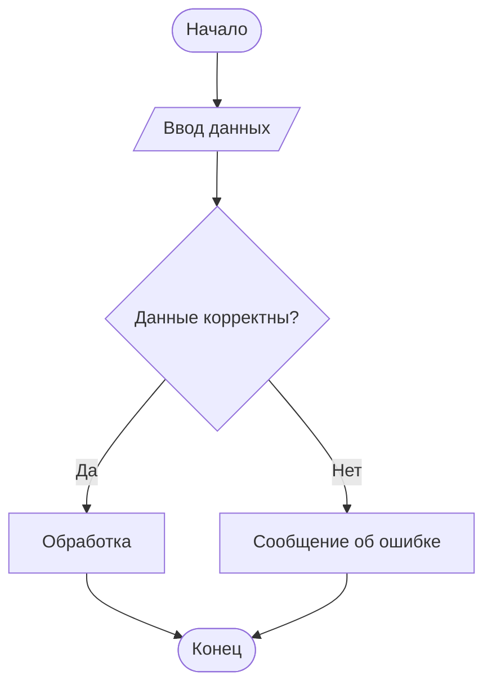
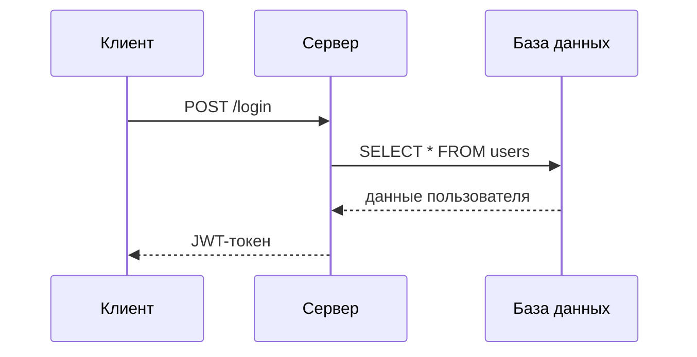
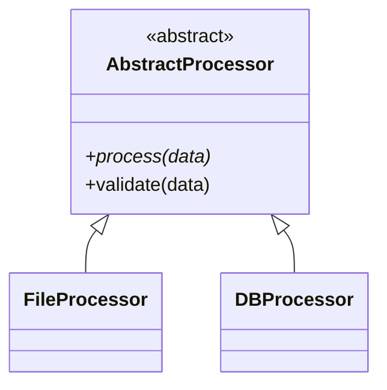
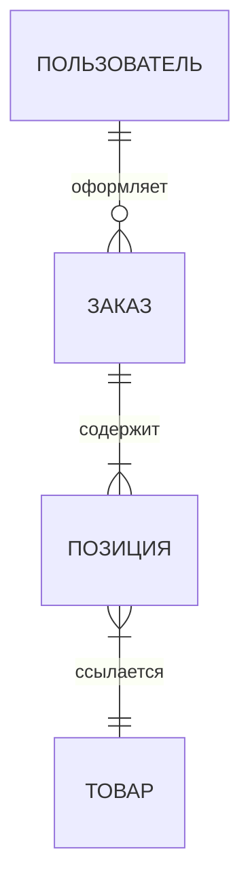

# Skill: GOST Academic Writer

## Назначение

Данный скилл используется для написания академических работ (ВКР, дипломная работа, курсовая работа, магистерская диссертация, НИР) в формате Markdown, который корректно конвертируется в DOCX-файл, соответствующий требованиям ГОСТ по оформлению (КубГУ, 2019 / ГОСТ 7.32-2017).

---

## ЧАСТЬ 1: АБСОЛЮТНЫЕ ПРАВИЛА (НАРУШАТЬ НЕЛЬЗЯ)

Следующие правила контролируются транспилятором и напрямую влияют на соответствие ГОСТ.

### 1.1 Поля страницы (задаются автоматически)
- Левое поле: **30 мм** (для переплёта)
- Правое поле: **15 мм**
- Верхнее поле: **20 мм**
- Нижнее поле: **20 мм**

### 1.2 Шрифт (задаётся автоматически)
- **Times New Roman, 14 пт, чёрный**
- Межстрочный интервал: **1,5**
- Абзацный отступ: **1,25 см** (первая строка)
- Выравнивание: **по ширине** (для основного текста)

### 1.3 Нумерация страниц (задаётся автоматически)
- Арабские цифры, **по центру нижнего поля**
- Без точки после номера
- Титульный лист входит в нумерацию, но номер **не проставляется**

---

## ЧАСТЬ 2: СИНТАКСИС MD-ФАЙЛА

### 2.1 Обязательная YAML-шапка

```yaml
---
type: vkr
title: Полное название работы
author: Фамилия Имя Отчество
year: 2024
---
```

Поле `type`: `vkr` | `kursovaya` | `diplomnaya` | `magisterskaya` | `nir`

### 2.2 Структурные заголовки

Ключевые слова — **СТРОГО прописными** через `#`:

```
# СОДЕРЖАНИЕ
# ВВЕДЕНИЕ
# ЗАКЛЮЧЕНИЕ
# СПИСОК ИСПОЛЬЗОВАННЫХ ИСТОЧНИКОВ
# РЕФЕРАТ
```

**НЕЛЬЗЯ:** `# Введение`, `# Заключение`, `## ЗАКЛЮЧЕНИЕ`
**ПРАВИЛЬНО:** `# ВВЕДЕНИЕ`, `# ЗАКЛЮЧЕНИЕ`

### 2.3 Нумерация разделов

```
# 1 Название раздела              ← Уровень 1 (жирный, с абзацного отступа)
## 1.1 Название подраздела        ← Уровень 2 (жирный, с абзацного отступа)
### 1.1.1 Название пункта         ← Уровень 3
#### 1.1.1.1 Название подпункта   ← Уровень 4
```

**НЕЛЬЗЯ:**
- `# 1. Название` (точка после цифры)
- `##1.1 Название` (нет пробела)
- `# Первый раздел` (без номера)

**ПРАВИЛЬНО:**
- `# 1 Название раздела`
- `## 1.1 Название подраздела`

### 2.4 Приложения

```
# ПРИЛОЖЕНИЕ А
> Название приложения с прописной буквы

Текст приложения...

# ПРИЛОЖЕНИЕ Б
> Название второго приложения
```

**Допустимые буквы** (по ГОСТ): А Б В Г Д Е Ж И К Л М Н П Р С Т У Ф Х Ц Ш Щ Э Ю Я
**Запрещённые буквы**: Ё З Й О Ч Ъ Ы Ь

---

## ЧАСТЬ 3: ПРАВИЛА НАПИСАНИЯ ТЕКСТА

### 3.1 Тире в тексте

В академическом тексте используется **среднее тире `–` (U+2013)** — для пауз в предложениях, диапазонов, определений.
Длинное тире `—` (U+2014) **не используется**: транспилятор автоматически заменяет его на `–`.

```markdown
Блокчейн – технология распределённого реестра.   ← ПРАВИЛЬНО
Период исследования – 2021–2024 годы.             ← ПРАВИЛЬНО
```

### 3.3 Запрещённые конструкции в основном тексте

| НЕЛЬЗЯ | ПРАВИЛЬНО |
|--------|-----------|
| `-5` (минус перед числом) | `минус 5` |
| `⌀50` (диаметр) | `диаметр 50 мм` |
| `>5` без значения | `более 5` |
| `<5` без значения | `менее 5` |
| `=5` без значения | `равно 5` |
| `≤5` без значения | `не более 5` |
| `≥5` без значения | `не менее 5` |
| `№5` | `номер 5` |
| `5%` без числа | `5 процентов` или `5 %` |
| Числа 1-9 без единиц | Словами: «три», «пять», «девять» |
| Числа ≥10 без единиц | Цифрами: «10», «25», «100» |

### 3.4 Числа с единицами измерения

```markdown
Длина образца составила 150 мм.          ← цифра + пробел + единица
Исследовано три образца.                  ← без единицы от 1 до 9 → словами
В диапазоне от 5 мм до 50 мм.            ← единица после последнего числа
Значения 1,50; 1,75; 2,00 м.             ← единица после последнего значения
```

### 3.5 Сокращения

Допустимые аббревиатуры и сокращения (при первом упоминании расшифровать):
- Проф., доц., ст. преп., преп., зав., рук., зам.
- Нестандартные → расшифровать: «метод главных компонент (МГК)»

---

## ЧАСТЬ 4: ТАБЛИЦЫ

### 4.1 Формат

```markdown
<!-- Таблица N.M – Название таблицы -->
| Заголовок 1 | Заголовок 2 | Заголовок 3 |
|-------------|-------------|-------------|
| Данные      | Данные      | –           |
```

### 4.2 Правила нумерации

| Тип нумерации | Формат | Пример |
|---------------|--------|--------|
| Сквозная | `Таблица N` | `Таблица 1` |
| По разделу (рекомендуется) | `Таблица N.M` | `Таблица 2.1` |
| В приложении | автоматически | `Таблица А.1` |

### 4.3 Ключевые правила

- Подпись — **ВСЕГДА ВЫШЕ** таблицы
- Подпись: `Таблица N.M – Название` (тире `–`, не дефис `-`)
- Шрифт подписи: **14 пт** (Times New Roman) — автоматически
- Нет данных → `–` (тире)
- Размер шрифта внутри таблицы допускается меньше (12 пт)
- При переносе таблицы на следующую страницу пишется «Продолжение таблицы N.M»

---

## ЧАСТЬ 5: РИСУНКИ

### 5.1 Синтаксис

```markdown

```

### 5.2 Правила

- Подпись генерируется **АВТОМАТИЧЕСКИ** ниже рисунка: `Рисунок N – Описание`
- В приложениях: `Рисунок А.1 – Описание`
- Описание в `[...]` — без слов «Рисунок», «Рис.», номера
- Форматы: PNG, JPG (рекомендуется PNG для чёткости)
- Путь — **относительный** от расположения MD-файла

### 5.3 Ссылки на рисунки

```markdown
(см. рисунок 2.1)                ← в скобках
в соответствии с рисунком 3      ← в тексте
на рисунке А.1 показано          ← для приложений
```

### 5.4 Диаграммы Mermaid (вместо файла изображения)

Когда нужно изобразить схему, алгоритм, структуру классов, последовательность взаимодействий, ER-диаграмму или диаграмму Ганта — используй Mermaid-блок. Транспилятор сам отрисует диаграмму в PNG и оформит как рисунок по ГОСТ.

**Синтаксис:**

````markdown
```mermaid Описание диаграммы (станет подписью «Рисунок N – Описание»)
<mermaid-код>
```
````

**Правила:**
- Описание обязательно — пишется через пробел после слова `mermaid`
- Нумерация сквозная, те же правила, что у обычных рисунков
- В приложениях: `Рисунок А.1 – Описание`

**Типовые шаблоны для академических работ:**

Блок-схема алгоритма:
````markdown

````

Диаграмма последовательности:
````markdown

````

Диаграмма классов:
````markdown

````

ER-диаграмма:
````markdown

````

---

## ЧАСТЬ 5.5: ЛИСТИНГИ ПРОГРАММНОГО КОДА

> Актуально для НИР, ВКР и дипломных работ в области информатики и IT.
> ГОСТ 7.32-2017 не регламентирует листинги напрямую, однако допускает компьютерное оформление для акцентирования терминов и формул. Листинги оформляются по общепринятым правилам для IT-документации.

### Синтаксис

````markdown
```язык
код...
код...
```
````

**Поддерживаемые обозначения языка:** `python`, `typescript`, `javascript`, `java`, `c`, `cpp`, `funC`, `yaml`, `json`, `sql`, `dockerfile`, `bash`, `go`, `rust` и любые другие — транспилятор использует название только как метку, не влияет на подсветку.

### Оформление в DOCX (автоматически)

| Параметр | Значение |
|---|---|
| Шрифт | Courier New, 12 пт |
| Выравнивание | По левому краю |
| Абзацный отступ первой строки | 0 (нет) |
| Отступ слева | 1,25 см |
| Межстрочный интервал | Одинарный (1,0) |
| Фон | Светло-серый (#F2F2F2) |
| Отступы между строками кода | 0 пт |

### Правила

- Перед блоком кода и после него — **пустая строка**
- Ссылаться на листинги в тексте через слова «как показано ниже», «функция `name`», «код выше» — отдельной нумерации листингов нет
- Не используй `**жирный**` внутри блока кода — он не форматируется
- Inline-код (имя переменной или функции в тексте) — обрамляй одиночными обратными кавычками: `` `имя` ``

### Пример (правильно)

````markdown
Функция `load_data` читает хранилище контракта:

```funC
(slice, slice, int, int, int, slice) load_data() inline {
    slice ds = get_data().begin_parse();
    return (
        ds~load_msg_addr(),
        ds~load_msg_addr(),
        ds~load_coins()
    );
}
```

Как видно из кода выше, обращение к хранилищу выполняется один раз.
````

---

## ЧАСТЬ 6: ФОРМУЛЫ

> **Все формулы `$$...$$` и inline-математика `$...$` автоматически конвертируются
> в нативные Word Math объекты (OMML), размер шрифта **14 пт**. Формулы редактируемы в Word.**
> Используйте стандартный LaTeX-синтаксис. Команды `\displaystyle`, `\textstyle`,
> `\bigl`, `\bigr`, `\left`, `\right` автоматически удаляются транспилятором — не влияют на вывод.

### 6.1 Однострочная формула с явным номером

```markdown
$$y = ax + b$$ (1.1)
```

### 6.2 Однострочная формула с авто-нумерацией

```markdown
$$K = \frac{P_1 - P_0}{P_0} \cdot 100$$
```

### 6.3 Многострочная формула

```markdown
$$
E = \sum_{t=1}^{T} \frac{CF_t}{(1 + r)^t} - I_0
$$
```

### 6.4 Блок «где» (ОБЯЗАТЕЛЕН для каждой формулы с символами)

```markdown
$$\rho = \frac{m}{V}$$

где $\rho$ – плотность образца, кг/м³;
- $m$ – масса образца, кг;
- $V$ – объём образца, м³.
```

**Правила блока «где»:**
1. Слово «где» с маленькой буквы
2. **Без двоеточия** после «где»
3. Первый символ — в той же строке после «где »
4. Последующие символы — каждый с новой строки, начиная с `- `
5. После каждого символа кроме последнего — `;`
6. После последнего символа — `.`
7. Каждый символ пишется в `$...$`, затем ` – ` (тире), затем определение

### 6.5 Ссылки на формулы

```markdown
...как показано в формуле (1.1)...
...подставив в (3.2) значения...
```

---

## ЧАСТЬ 7: СПИСКИ

### 7.1 Список с тире (стандартный)

```markdown
Текст перед списком:

- первый элемент;
- второй элемент;
- третий элемент.
```

Транспилятор заменяет `-` на `–` (тире).

### 7.2 Список с буквами

```markdown
а) первый подпункт;
б) второй подпункт;
в) третий подпункт.
```

### 7.3 Вложенный список

```markdown
Перечень включает:

- первая группа:
1) первый элемент;
2) второй элемент;
- вторая группа:
1) первый элемент;
2) второй элемент.
```

---

## ЧАСТЬ 8: БИБЛИОГРАФИЧЕСКИЕ ССЫЛКИ

### 8.1 Затекстовые ссылки (рекомендуемый метод)

В тексте: `[N]` или `[N, с. P]`

```markdown
По данным исследования [1, с. 45] установлено...
Авторы [2, 3] отмечают...
В работе [14] показано...
```

### 8.2 Список источников по ГОСТ 7.1-2003

```markdown
# СПИСОК ИСПОЛЬЗОВАННЫХ ИСТОЧНИКОВ

1. Фамилия И. О. Название книги / И. О. Фамилия. – Город: Изд-во, Год. – N с.

2. Фамилия И. О. Название статьи / И. О. Фамилия // Журнал. – Год. – № N. – С. N–N.

3. ГОСТ N–ГГГГ. Название стандарта. – М.: Стандартинформ, Год. – N с.

4. Название ресурса [Электронный ресурс]. – URL: https://... (дата обращения: ДД.ММ.ГГГГ).
```

**Правила:**
- Нумерация сквозная, арабскими цифрами
- Источники располагать в алфавитном порядке ИЛИ в порядке упоминания в тексте
- Сначала источники на русском, затем на иностранных языках

---

## ЧАСТЬ 9: ТРЕБОВАНИЯ К СОДЕРЖАНИЮ КАЖДОГО РАЗДЕЛА

### 9.1 ВВЕДЕНИЕ (обязательные элементы)

```markdown
# ВВЕДЕНИЕ

[1-2 абзаца] Актуальность темы...

Цель работы — ...

Для достижения поставленной цели необходимо решить следующие задачи:

- первая задача (соответствует Разделу 1);
- вторая задача (соответствует Разделу 2);
- третья задача (соответствует Разделу 3).

Объект исследования — ...

Предмет исследования — ...

[Опционально для ВКР/диссертации:]
Методы исследования: ...
Теоретическая база исследования: ...
Практическая значимость работы: ...
Структура работы: работа состоит из введения, N глав, заключения, 
списка использованных источников (N источников) и N приложений.
```

### 9.2 Основная часть (разделы 1, 2, 3...)

Структура основной части определяется темой работы. Типовая структура:

**Раздел 1 (теоретический):**
- 1.1 — обзор понятий и определений
- 1.2 — анализ существующих подходов
- 1.3 — выводы по разделу

**Раздел 2 (аналитический):**
- 2.1 — характеристика объекта исследования
- 2.2 — анализ текущего состояния
- 2.3 — выявленные проблемы

**Раздел 3 (практический/проектный):**
- 3.1 — предложения/решения
- 3.2 — обоснование эффективности
- 3.3 — выводы

### 9.3 ЗАКЛЮЧЕНИЕ (обязательные элементы)

```markdown
# ЗАКЛЮЧЕНИЕ

В результате проведённого исследования были получены следующие выводы:

- первый вывод (по результатам Раздела 1);
- второй вывод (по результатам Раздела 2);
- третий вывод (по результатам Раздела 3).

Цель работы достигнута. Все поставленные задачи решены.

[Для ВКР/диссертации:]
Практическая значимость результатов состоит в...

Полученные результаты могут быть использованы...
```

---

## ЧАСТЬ 10: ТИПИЧНЫЕ ОШИБКИ

### Ошибка 1: Строчные буквы в структурных заголовках

```markdown
# Введение          ← НЕПРАВИЛЬНО
# ВВЕДЕНИЕ          ← ПРАВИЛЬНО
```

### Ошибка 2: Точка после номера раздела

```markdown
# 1. Название       ← НЕПРАВИЛЬНО
# 1 Название        ← ПРАВИЛЬНО
```

### Ошибка 3: Подпись таблицы ниже таблицы

```markdown
| Кол 1 | Кол 2 |
|-------|-------|
| A     | B     |
Таблица 1 – Название   ← НЕПРАВИЛЬНО (подпись ниже)

<!-- Таблица 1 – Название -->    ← ПРАВИЛЬНО (перед таблицей)
| Кол 1 | Кол 2 |
```

### Ошибка 4: Двоеточие после «где» в формуле

```markdown
где:                   ← НЕПРАВИЛЬНО
$\rho$ – плотность     

где $\rho$ – плотность ← ПРАВИЛЬНО
```

### Ошибка 5: Неправильный синтаксис списка

```markdown
* первый элемент      ← НЕПРАВИЛЬНО (звёздочка)
1. первый элемент     ← НЕПРАВИЛЬНО (точка вместо скобки)

- первый элемент      ← ПРАВИЛЬНО (тире)
1) первый элемент     ← ПРАВИЛЬНО (скобка после цифры)
```

### Ошибка 6: Перенос слов в заголовке

```markdown
## 1.1 Анализ инвестиционного
потенциала региона             ← НЕПРАВИЛЬНО (перенос)

## 1.1 Анализ инвестиционного потенциала региона  ← ПРАВИЛЬНО
```

### Ошибка 7: Использование неправильных символов

```markdown
Температура: -5°C             ← НЕПРАВИЛЬНО
Температура: минус 5°C        ← ПРАВИЛЬНО

Диаметр: ⌀50 мм               ← НЕПРАВИЛЬНО
Диаметр: 50 мм                ← ПРАВИЛЬНО
```

### ❌ Ошибка 8: Жирный шрифт в теле работы

```markdown
В ходе исследования **было установлено**, что...   ← НЕПРАВИЛЬНО
В ходе исследования было установлено, что...       ← ПРАВИЛЬНО

**Вывод:** результаты подтверждают гипотезу.       ← НЕПРАВИЛЬНО
Вывод: результаты подтверждают гипотезу.           ← ПРАВИЛЬНО
```

Жирное начертание (`**...**`) допустимо исключительно в заголовках разделов (формируются через `#`).
В теле работы — абзацах, списках, подписях к таблицам и рисункам — `**...**` не используется.
Для выделения термина при первом упоминании используйте курсив: `*термин*`.

### ❌ Ошибка 9: Явный разрыв страницы перед разделом

```markdown
---
# ЗАКЛЮЧЕНИЕ        ← НЕПРАВИЛЬНО: --- создаёт пустой лист

# ЗАКЛЮЧЕНИЕ        ← ПРАВИЛЬНО: транспилятор сам начинает с новой страницы
```

Транспилятор **автоматически** начинает с новой страницы:
- все `# СТРУКТУРНЫЙ ЗАГОЛОВОК` (ВВЕДЕНИЕ, ЗАКЛЮЧЕНИЕ, СПИСОК ИСПОЛЬЗОВАННЫХ ИСТОЧНИКОВ и др.)
- все `# N Раздел` первого уровня
- все `# ПРИЛОЖЕНИЕ X`

Используйте `---` только внутри раздела, когда нужен явный разрыв между смысловыми блоками без заголовка.

---

## ЧАСТЬ 11: ЧЕК-ЛИСТ АГЕНТА ПЕРЕД ГЕНЕРАЦИЕЙ

Перед тем как сгенерировать MD-файл, проверьте каждый пункт:

**Структура:**
- [ ] YAML-шапка с полями type, title, author, year
- [ ] `# СОДЕРЖАНИЕ` — первый раздел
- [ ] `# ВВЕДЕНИЕ` — второй раздел  
- [ ] Разделы пронумерованы: `# 1`, `# 2`, `# 3`
- [ ] `# ЗАКЛЮЧЕНИЕ` — предпоследний раздел
- [ ] `# СПИСОК ИСПОЛЬЗОВАННЫХ ИСТОЧНИКОВ` — последний обязательный раздел

**Заголовки:**
- [ ] Структурные — ПРОПИСНЫМИ
- [ ] Нумерованные — формат `# N Название` (без точки)
- [ ] Нет переносов в заголовках
- [ ] Каждый заголовок в одной строке
- [ ] Нет `---` перед структурными заголовками и разделами `# N` — создаёт пустой лист!

**Таблицы:**
- [ ] Каждая таблица предварена строкой `<!-- Таблица N.M – Название -->`
- [ ] Тире в названии — `–` (длинное, не дефис `-`)
- [ ] Отсутствующие данные — `–`

**Формулы:**
- [ ] После формулы — блок «где» без двоеточия
- [ ] Каждый символ в `$...$`
- [ ] Последовательность: `;` после каждого, `.` после последнего

**Текст:**
- [ ] Числа 1-9 без единиц написаны словами
- [ ] Нет знака `–` перед отрицательными числами (написано «минус»)
- [ ] Нет `№`, `%` без числа, `⌀`
- [ ] Ссылки на источники в квадратных скобках `[N]` или `[N, с. P]`
- [ ] Нет `**жирного**` в теле работы — только в заголовках через `#`

**Рисунки и диаграммы:**
- [ ] Обычные рисунки: ``, путь существует
- [ ] Mermaid-блоки: ` ```mermaid Описание ` (описание обязательно)

**Листинги кода (для IT-работ):**
- [ ] Блок кода: открывающая строка ` ```язык ` (или просто ` ``` `), закрывающая ` ``` `
- [ ] Перед блоком и после — пустая строка
- [ ] Inline-код в тексте обёрнут одиночными обратными кавычками: `` `имя_функции` ``

**Список источников:**
- [ ] Каждый источник на отдельной строке с номером
- [ ] Соответствует ГОСТ 7.1-2003

---

## ЧАСТЬ 12: АЛГОРИТМ РАБОТЫ АГЕНТА

При получении задания написать академическую работу следуйте порядку:

1. **Создайте файл** `work.md` с YAML-шапкой
2. **Добавьте** `# СОДЕРЖАНИЕ`
3. **Напишите ВВЕДЕНИЕ** со всеми обязательными элементами (актуальность, цель, задачи, объект, предмет)
4. **Напишите разделы** в порядке: теоретический → аналитический → практический
5. **Напишите ЗАКЛЮЧЕНИЕ** с выводами по каждому разделу
6. **Составьте СПИСОК ИСПОЛЬЗОВАННЫХ ИСТОЧНИКОВ** по ГОСТ
7. **Добавьте приложения** (если нужны)
8. **Запустите транспилятор:** `python3 transpiler.py work.md work.docx`
9. **Проверьте** сгенерированный DOCX

---

## ЧАСТЬ 13: СПЕЦИФИКА ДЛЯ РАЗНЫХ ТИПОВ РАБОТ

### ВКР бакалавра / Дипломная работа
- Объём: 50-80 страниц
- Разделов: 3
- Обязательны: ВВЕДЕНИЕ (полное), приложения
- Введение должно содержать: актуальность, противоречие, проблему, цель, задачи, объект, предмет, методы, базу исследования, практическую значимость, структуру работы

### Курсовая работа
- Объём: 25-40 страниц
- Разделов: 2-3
- Введение: актуальность, цель, задачи, объект, предмет

### Магистерская диссертация
- Объём: 80-120 страниц
- Разделов: 3-5
- Обязателен РЕФЕРАТ (`# РЕФЕРАТ`)
- Введение расширенное: гипотеза, научная новизна, положения на защиту

### НИР (научно-исследовательская работа)
- Структура по ГОСТ 7.32-2017
- Реферат: актуальность, цель, методы, результаты, рекомендации
- Разделы: аналитический обзор → методика → результаты → обсуждение
