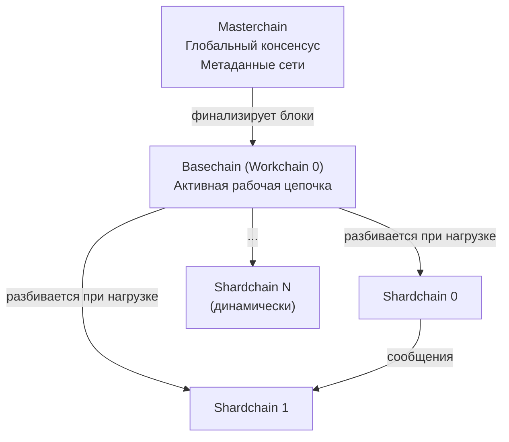
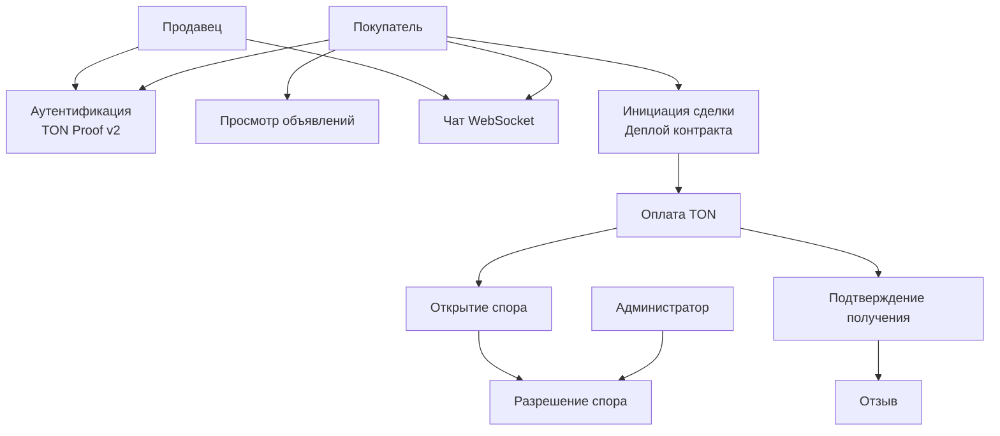
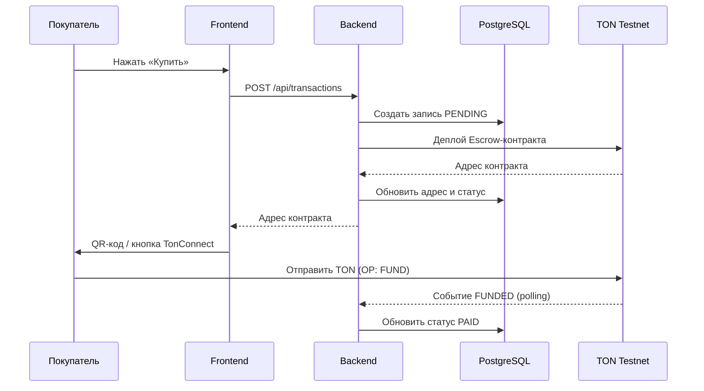

# РЕФЕРАТ

Научно-исследовательская работа по теме «Разработка прототипа торговой площадки с использованием блокчейн технологий» содержит 28 страниц, 4 рисунка, 5 таблиц, 20 библиографических источников.

Ключевые слова: блокчейн, смарт-контракт, эскроу, P2P-маркетплейс, TON, TonConnect, децентрализованные приложения, Web3, криптографическая аутентификация, FunC.

Объект исследования – децентрализованные торговые платформы на основе технологий распределённого реестра.

Предмет исследования – методы обеспечения доверия в P2P-транзакциях с применением смарт-контрактов на блокчейне TON.

Цель работы – исследовать применимость технологий блокчейн для реализации P2P-торговой площадки с эскроу-механизмом на примере экосистемы TON.

Методы исследования: системный анализ, сравнительный анализ существующих решений, проектирование программного обеспечения, натурный эксперимент в тестовой сети TON Testnet.

Результаты работы: проведён обзор существующих торговых платформ; выявлены ключевые проблемы P2P-решений; исследованы архитектура TON и механизмы смарт-контрактов на языке FunC; сформулированы требования к системе; обоснован технологический стек; реализован прототип в тестовой сети TON.

Область применения – электронная коммерция, Web3, системы P2P-торговли.

# СОДЕРЖАНИЕ

# ВВЕДЕНИЕ

P2P-торговля в интернете сопряжена с проблемой доверия между незнакомыми участниками сделки. По данным Chainalysis, потери от мошенничества в криптовалютных P2P-транзакциях превысили 4,6 млрд долларов в 2023 году. Отечественные платформы (Avito, Юла) ежегодно получают десятки тысяч жалоб на схемы с предоплатой без отгрузки товара.

Стандартное решение – централизованный посредник в роли эскроу. Его ограничения известны: комиссия до десяти процентов, право заморозить средства по собственному усмотрению, единая точка отказа и обязательная передача персональных данных.

Блокчейн-технология, описанная Сатоши Накамото в 2008 году [1], предлагает альтернативу: роль посредника берёт на себя смарт-контракт – программа, исполняемая децентрализованно и не подконтрольная ни одной стороне. Виталик Бутерин в 2014 году [2] расширил эту идею, создав Ethereum с поддержкой произвольных вычислений в контрактах.

Блокчейн TON (The Open Network), открытый в 2020 году [3], привлекателен для P2P-торговли: динамическое шардирование обеспечивает высокую пропускную способность, интеграция с Telegram даёт доступ к аудитории более 900 миллионов пользователей, а число активных кошельков в сети превышает 100 миллионов [9]. При этом в экосистеме TON нет платформы для торговли физическими товарами с эскроу – существующие маркетплейсы Fragment и Getgems работают только с цифровыми активами.

Это противоречие между спросом на безопасные P2P-сделки в TON и отсутствием соответствующего инструмента определяет актуальность исследования.

Цель работы – исследовать применимость блокчейн-технологий для реализации прототипа P2P-торговой площадки с эскроу-механизмом на основе смарт-контрактов TON.

Для достижения цели поставлены следующие задачи:

- изучить базовые концепции блокчейн-технологий и механизмы работы смарт-контрактов;
- исследовать архитектуру и особенности блокчейна TON;
- провести сравнительный анализ существующих торговых платформ;
- выявить проблемы P2P-маркетплейсов и сформулировать требования к системе;
- обосновать технологический стек и проанализировать ключевые технические проблемы реализации.

Объект исследования – децентрализованные торговые платформы на основе технологий распределённого реестра.

Предмет исследования – методы обеспечения доверия в P2P-транзакциях с применением смарт-контрактов TON.

Методы исследования: системный анализ, сравнительный анализ, обзор научной литературы, проектирование программного обеспечения, натурный эксперимент в TON Testnet.

Теоретическую базу составляют труды Накамото [1], Бутерина [2], Дурова [3], Свон [4, 6], Тапскоттов [5], а также публикации по блокчейн-системам и децентрализованным приложениям [7–20].

Практическая значимость: результаты исследования легли в основу прототипа, развёрнутого на домене ton-marketplace.ru в тестовой сети TON Testnet.

Работа состоит из введения, двух разделов, заключения и списка использованных источников (20 источников).

# 1 Теоретические основы децентрализованных торговых систем на основе блокчейн

## 1.1 Блокчейн-технологии: концепции и эволюция

Блокчейн – технология распределённого реестра, в котором записи о транзакциях группируются в блоки, связанные криптографическими хэшами, и реплицируются между участниками сети [1]. Ключевые свойства технологии:

- децентрализация – отсутствие единого центра управления;
- прозрачность – история транзакций открыта любому участнику;
- иммутабельность – изменить записанные данные практически невозможно без пересчёта всей последующей цепочки;
- отказоустойчивость – сеть продолжает работу при выходе части узлов.

Bitcoin [1] стал первым практическим применением технологии: он решал задачу передачи ценности между участниками без доверенного посредника. Механизм Proof-of-Work обеспечивал консенсус, но ограничивал пропускную способность – до семи транзакций в секунду.

Платформа Ethereum [2] ввела тьюринг-полные смарт-контракты. Ethereum Virtual Machine выполняет код детерминированно на всех узлах, а результат записывается в блокчейн без возможности последующего изменения. Это открыло возможность для реализации произвольной бизнес-логики: финансовых инструментов, голосований, децентрализованных бирж и эскроу [6].

Принято выделять три поколения блокчейн-технологий [4]:

- первое поколение (Bitcoin) – передача ценностей, ограниченная скриптовая логика;
- второе поколение (Ethereum) – произвольные смарт-контракты, децентрализованные приложения;
- третье поколение (TON, Solana, Avalanche) – решение проблем масштабируемости при сохранении децентрализации.

Классический Ethereum обрабатывал до 15 транзакций в секунду. Исследование Heimbach et al. [17] показывает, что сложные зависимости DeFi-протоколов внутри одного блока ограничивают потенциальное ускорение коэффициентом пять при любых оптимизациях – горизонтальное масштабирование на уровне L1 принципиально ограничено. Это подтолкнуло к появлению платформ третьего поколения с архитектурным шардированием.

## 1.2 Экосистема TON: архитектура и особенности

TON изначально разрабатывался командой Telegram в 2018–2019 годах. В 2021 году после урегулирования разногласий с SEC права на разработку перешли к сообществу, оформившемуся в TON Foundation [3]. Тесная интеграция с Telegram – встроенный кошелёк TON Wallet доступен в мессенджере без установки отдельных приложений – обеспечивает платформе уникальный охват аудитории.

Архитектура TON строится на иерархии трёх уровней [3]:

- мастерчейн – главная цепочка с глобальным консенсусом и метаданными сети;
- воркчейны – рабочие цепочки с собственными правилами (сейчас активна одна);
- шардчейны – фрагменты воркчейна, создаваемые или объединяемые автоматически при росте или снижении нагрузки.

Теоретическая пропускная способность при полном шардировании превышает один миллион транзакций в секунду [3]. В реальных условиях значения ниже, однако даже практическая производительность существенно превосходит Ethereum L1.

Смарт-контракты исполняются TON Virtual Machine – стековой виртуальной машиной. Данные в TON хранятся в формате Bag of Cells: рекурсивно вложенных ячеек с данными и ссылками. Важное отличие от Ethereum – асинхронная модель взаимодействия контрактов: вместо синхронных вызовов контракты обмениваются сообщениями. Это снижает риск reentrancy-атак, но требует явного управления порядком обработки сообщений.

Смарт-контракты пишутся на языке FunC, с 2024 года параллельно развивается более современный Tolk. Аутентификация пользователей реализована через протокол TonConnect и механизм TON Proof v2: кошелёк подписывает специальное сообщение с адресом, доменом приложения и временно́й меткой; сервер верифицирует подпись по публичному ключу без передачи паролей [8].

Для P2P-маркетплейса особый интерес представляют Telegram Mini Apps – веб-приложения внутри Telegram с нативным доступом к кошельку пользователя. Они позволяют совершить покупку, не покидая мессенджер, что значительно снижает порог входа.

## 1.3 Смарт-контракты как механизм доверия в P2P-торговле

Концепцию смарт-контракта сформулировал Ник Сзабо в 1996 году [7]: «компьютеризованный транзакционный протокол, исполняющий условия контракта». В блокчейне смарт-контракты хранятся в сети и исполняются детерминированно. Неизменность кода после развёртывания гарантирует, что ни одна из сторон не сможет изменить правила по ходу сделки [2, 7].

Для P2P-торговли ключевой паттерн – эскроу. В классическом варианте участвуют три стороны: покупатель, продавец и доверенный агент-хранитель средств. В смарт-контрактной модели агента заменяет программный код:

- покупатель переводит средства на адрес контракта, где они блокируются;
- подтверждение получения товара высвобождает средства продавцу;
- при споре администратор принимает решение в пользу одной из сторон.

Kalbantner et al. [13] показывают, что DLT-контракты позволяют реализовать честный обмен без взаимного доверия сторон. Banerjee et al. [11] демонстрируют практическую применимость смарт-контрактного эскроу на примере децентрализованного маркетплейса контента.

Ограничения смарт-контрактов важно учитывать при проектировании:

- контракт не может самостоятельно проверить физическую доставку – это требует арбитра или оракула;
- ошибка в коде неисправима после развёртывания, что повышает требования к тестированию;
- Javed и Mangues-Bafalluy [15] эмпирически показывают: 86 % транзакций на Ethereum подтверждаются в течение 30 секунд; для TON характерны ещё меньшие задержки.

Логику эскроу удобно формализовать как конечный автомат. Контракт проходит множество состояний $S = \{CREATED, FUNDED, RELEASED, REFUNDED\}$ с функцией перехода $\delta: S \times M \rightarrow S$, где $M$ – множество входящих сообщений. Переходы:

$$\delta(CREATED, \text{FUND}) = FUNDED$$ (1.1)

$$\delta(FUNDED, \text{RELEASE}) = RELEASED$$ (1.2)

$$\delta(FUNDED, \text{REFUND}) = REFUNDED$$ (1.3)

Переход допустим только из корректного исходного состояния; сообщение в неверном состоянии отбрасывается. Право на каждую операцию также проверяется: FUND – только покупатель, RELEASE – покупатель или администратор, REFUND – администратор или любой по истечении таймаута.

## 1.4 Анализ существующих торговых платформ

Для определения ниши разрабатываемого прототипа рассмотрим три группы существующих решений.

Классические P2P-маркетплейсы (Avito, eBay) строятся на централизованном эскроу. eBay удерживает от восьми до двенадцати процентов суммы плюс комиссию за платёж. Avito берёт до пяти процентов за «Безопасную сделку», а споры решают сотрудники платформы. Для небольших сделок суммарные издержки делают эти сервисы экономически невыгодными.

NFT-маркетплейсы (OpenSea, Rarible, Getgems) работают с цифровыми активами: доверие обеспечивается самим стандартом токена, передача происходит атомарно через контракт. Для торговли физическими товарами они не предназначены – нет механизма проверки физической доставки.

P2P-криптообменники (Paxful, Binance P2P) реализуют эскроу для обмена криптовалюты на фиат. Логика схожа с предлагаемым решением, но предмет торговли – исключительно финансовые инструменты, и все платформы требуют KYC-верификации.

Исследование Wu [14] показывает: из 734 проанализированных децентрализованных приложений большинство относится к играм и DeFi, а P2P-маркетплейсы физических товаров практически отсутствуют в блокчейн-экосистемах.

<!-- Таблица 1.1 – Сравнительный анализ существующих торговых платформ -->
| Параметр | Avito / OLX | OpenSea | Fragment / Getgems | Paxful | Разрабатываемый прототип |
|---|---|---|---|---|---|
| Тип активов | Физические товары | NFT | NFT / имена Telegram | Крипто ↔ фиат | Физические товары |
| Блокчейн | Нет | Ethereum | TON | Bitcoin / др. | TON |
| Механизм эскроу | Централизованный | Встроен в NFT | Встроен в NFT | Централизованный | Смарт-контракт TON |
| Аутентификация | Email / телефон | Кошелёк | Кошелёк / Telegram | KYC + телефон | TON-кошелёк |
| Комиссия платформы | 2–10 % | 2,5 % | 5 % | 0,5–1 % | Только газ (~0.01 TON) |
| Анонимность | Нет | Частичная | Частичная | Нет (KYC) | Да |
| Чат | Да | Нет | Нет | Да | Да (WebSocket) |
| P2P физических товаров в TON | – | – | Нет | – | Да |

Из таблицы следует: в экосистеме TON нет платформы для безопасной торговли физическими товарами с верифицируемым эскроу. Truong et al. [12] указывают на фундаментальный предел децентрализации: блокчейн гарантирует безопасность on-chain данных, но не качество сервиса в физическом мире. Это обосновывает необходимость минимального доверенного элемента – администратора-арбитра.

# 2 Аналитическое исследование и проектирование торговой площадки

## 2.1 Проблемы существующих P2P-маркетплейсов

На основе анализа платформ можно выделить четыре основных класса проблем.

Первая проблема – централизованное хранение средств. Платформа-хранитель может заморозить транзакцию, стать жертвой взлома или прекратить работу. Крах биржи FTX в 2022 году привёл к потере более восьми миллиардов долларов пользователей при аналогичной централизованной модели. Смарт-контракт исключает этот риск: средства хранятся в коде, доступ к которому определён исключительно условиями программы.

Вторая проблема – непрозрачность. Пользователи классических маркетплейсов вынуждены доверять интерфейсу платформы и не могут самостоятельно проверить состояние своих средств в эскроу. В блокчейн-модели состояние контракта открыто для проверки по адресу через блокчейн-эксплорер.

Третья проблема – высокие комиссии. Традиционные эскроу-сервисы берут от двух до десяти процентов суммы сделки. В TON единственная стоимость – газ сети (около 0.01 TON), что делает платформу экономически привлекательной для малых сделок.

Четвёртая проблема – барьеры входа. Большинство платформ требуют регистрации с подтверждением телефона, email или паспорта. Shehu et al. [16] показывают, что блокчейн-идентификация позволяет верифицировать участника без передачи персональных данных. Аутентификация через TON-кошелёк обеспечивает тот же эффект.

<!-- Таблица 2.1 – Проблемы P2P-маркетплейсов и предлагаемые решения -->
| Проблема | Следствие | Решение в прототипе |
|---|---|---|
| Централизованное хранение средств | Риск взлома / банкротства платформы | Смарт-контракт TON как хранитель |
| Непрозрачность эскроу | Невозможность независимой проверки | On-chain верификация по адресу контракта |
| Комиссии 2–10 % | Невыгодно для малых сумм | Только газ сети (~0.01 TON) |
| Обязательная идентификация | Барьер входа, риск утечки данных | Криптографическая аутентификация через кошелёк |
| Непрозрачное разрешение споров | Задержки, субъективность | Смарт-контракт + администратор с логированием |
| Отсутствие чата | Сложность согласования деталей | WebSocket-чат на объявление |

## 2.2 Требования к системе

### 2.2.1 Функциональные требования

Аутентификация – вход через TON-кошелёк по протоколу TonConnect с верификацией подписи Ed25519 (TON Proof v2) на сервере [8]. Аккаунт создаётся автоматически при первом входе.

Управление объявлениями: создание, редактирование, удаление объявлений с описанием, ценой, категорией и фотографиями; полнотекстовый поиск и фильтрация по параметрам.

Эскроу-механизм: при инициации сделки разворачивается смарт-контракт в TON с фиксацией адресов сторон, суммы и таймаута. Средства переводятся продавцу только при подтверждении покупателя или по решению арбитра.

Чат в реальном времени – переписка между покупателем и продавцом через WebSocket в контексте объявления.

Отзывы и рейтинг – оценка после завершения сделки; один отзыв на транзакцию (ограничение через UNIQUE constraint в базе данных).

Уведомления – события сделки доставляются через WebSocket и email.

### 2.2.2 Нефункциональные требования

Безопасность: валидация входных данных через class-validator; санитизация HTML для защиты от XSS; rate limiting на критических эндпоинтах; JWT-авторизация с проверкой активности аккаунта при каждом запросе.

Производительность: полнотекстовый поиск через PostgreSQL tsvector с GIN-индексом – время ответа менее 50 мс на базе до одного миллиона объявлений.

Интернационализация: русский и английский языки, определяются по URL-сегменту.

Воспроизводимость: запуск всех компонентов через Docker Compose.

## 2.3 Обоснование технологического стека

Выбор технологий определялся зрелостью экосистемы, поддержкой TypeScript, наличием официальных SDK TON и возможностью воспроизводимого развёртывания.

Серверная часть – NestJS (TypeScript, Node.js). Фреймворк реализует модульную архитектуру с инверсией управления и внедрением зависимостей, предоставляет встроенные абстракции для WebSocket (Gateway), очередей (Bull) и Guards.

Клиентская часть – Next.js с App Router. Server-Side Rendering обеспечивает индексацию страниц и сокращает время первой отрисовки. Архитектура фронтенда построена по Feature Sliced Design: app/ → page-views/ → widgets/ → features/ → entities/ → shared/ с однонаправленными зависимостями [6].

База данных – PostgreSQL 14. Задача полнотекстового поиска с поддержкой русского языка решается встроенными tsvector-индексами с конфигурацией «russian» без дополнительных сервисов. Redis и Bull используются для асинхронной отправки email-уведомлений с повторными попытками при ошибках.

Взаимодействие с блокчейном – официальные библиотеки @ton/ton, @ton/core, @ton/crypto. Для компиляции контракта применяется @ton-community/func-js – JavaScript-компилятор без нативных зависимостей, совместимый с Docker.

<!-- Таблица 2.2 – Сравнение блокчейн-платформ -->
| Критерий | TON | Ethereum | Solana |
|---|---|---|---|
| Теоретический TPS | 1 000 000+ (шардирование) | 15–30 (L1) | 65 000 |
| Комиссия за транзакцию | ~0.01 TON (менее $0.05) | $0.5–50 | ~$0.00025 |
| Интеграция с Telegram | Нативная (100 млн кошельков) | Отсутствует | Отсутствует |
| Язык смарт-контрактов | FunC / Tolk | Solidity | Rust / C |
| Целевая аудитория | Telegram-пользователи | Широкая | DeFi / GameFi |

TON выбран из-за прямой интеграции с Telegram – это обеспечивает наибольший потенциальный охват аудитории при минимальных издержках входа для пользователя.

<!-- Таблица 2.3 – Технологический стек -->
| Категория | Технология | Обоснование |
|---|---|---|
| Backend | NestJS 10.x | Модульность, TypeScript, IoC, WebSocket Gateway |
| Frontend | Next.js 16.x | SSR, App Router, next-intl |
| СУБД | PostgreSQL 14 | tsvector-поиск, JSONB, ACID |
| Кэш / очередь | Redis + Bull | Асинхронные задачи, retry |
| ORM | TypeORM 0.3.x | Декораторы-сущности, NestJS |
| WebSocket | Socket.IO 4.x | Rooms, JWT-авторизация |
| Блокчейн SDK | @ton/ton, @ton/core | Официальные библиотеки TON |
| Контракт | FunC | Нативный язык TON |
| Стили | Tailwind CSS + shadcn/ui | Утилитарный CSS, a11y |
| Инфраструктура | Docker + Traefik | SSL, маршрутизация, воспроизводимость |

Инфраструктура развёртывания: Docker Compose определяет пять сервисов – backend, frontend, db, redis, cloudflared. В продакшне добавляется Traefik с автоматическим SSL через Let's Encrypt. Запросы к /api/* и /socket.io/* направляются в бэкенд, остальные – во фронтенд.

## 2.4 Технические проблемы реализации

При проектировании системы выявлен ряд нетривиальных проблем.

### 2.4.1 Верификация TON Proof v2

Верификация требует сложной цепочки: сервер вычисляет хэш сообщения с адресом кошелька, доменом, временно́й меткой и payload, затем проверяет Ed25519-подпись по публичному ключу кошелька, который извлекается из блокчейна. Алгоритм:

$$\text{valid} = \text{Ed25519.verify}(h, \sigma, pk)$$ (2.1)

где $h$ – SHA-256 хэш структуры доказательства с префиксом `ton-proof-item-v2/`;
- $\sigma$ – подпись, полученная от кошелька;
- $pk$ – публичный ключ кошелька из блокчейна.

Временна́я метка проверяется условием:

$$|t_{\text{now}} - t_{\text{proof}}| \leq \Delta T_{\text{max}}$$ (2.2)

где $t_{\text{now}}$ – текущее серверное время;
- $t_{\text{proof}}$ – временна́я метка в доказательстве;
- $\Delta T_{\text{max}}$ – максимально допустимое отклонение (300 секунд).

### 2.4.2 HTTPS в среде разработки

TonConnect требует HTTPS – кошелёк отказывается подписывать данные для HTTP-адреса. Для локальной разработки применяется cloudflared: инструмент выдаёт публичный HTTPS-поддомен .trycloudflare.com. URL туннеля меняется при каждом перезапуске, поэтому скрипт docker-entrypoint.sh автоматически извлекает его из логов и перезаписывает tonconnect-manifest.json до запуска Next.js.

### 2.4.3 Синхронизация блокчейна и базы данных

В системе сосуществуют два источника истины: статус транзакции в PostgreSQL и состояние контракта в TON. При сетевых ошибках они могут расходиться. Принятый подход: бэкенд является ведущим источником и синхронизирует состояние с блокчейном по запросу. При открытии деталей сделки система запрашивает актуальное состояние через TON RPC и сравнивает с записью в базе.

### 2.4.4 Переменные окружения в Docker

В Next.js переменные с префиксом NEXT_PUBLIC_ компилируются в JavaScript-бандл на этапе сборки, а не читаются в runtime. Передача их через docker compose environment не действует, если образ уже собран. Переменные необходимо передавать как ARG в Dockerfile. При нарушении этого правила клиентский код использует адрес API, актуальный на момент сборки образа.

## 2.5 Тестирование смарт-контракта

Смарт-контракт нельзя обновить после деплоя – единственная возможность исправить ошибку это задеплоить новый контракт до поступления средств. Это делает тестирование критически важным этапом.

Для тестирования использована библиотека @ton/sandbox – изолированная среда, эмулирующая TON-блокчейн в памяти без обращения к реальной сети. Разработаны 12 тест-кейсов, покрывающих все ветви конечного автомата.

<!-- Таблица 2.4 – Результаты тестирования эскроу-контракта -->
| № | Тест-кейс | Ожидаемый результат | Статус |
|---|---|---|---|
| 1 | Деплой и начальное состояние | status=CREATED, адреса верны | Пройден |
| 2 | FUND от покупателя, корректная сумма | status=FUNDED, баланс увеличен | Пройден |
| 3 | FUND от стороннего адреса | Отклонено, статус не изменён | Пройден |
| 4 | FUND с недостаточной суммой | Отклонено | Пройден |
| 5 | RELEASE от покупателя при FUNDED | Средства продавцу, status=RELEASED | Пройден |
| 6 | RELEASE от администратора при FUNDED | Средства продавцу, status=RELEASED | Пройден |
| 7 | RELEASE от стороннего адреса | Отклонено | Пройден |
| 8 | REFUND от администратора при FUNDED | Средства покупателю, status=REFUNDED | Пройден |
| 9 | REFUND не-администратором до таймаута | Отклонено | Пройден |
| 10 | REFUND после истечения таймаута | Средства возвращены, status=REFUNDED | Пройден |
| 11 | Газовый резерв при переводе | 0.01 TON удержано контрактом | Пройден |
| 12 | Двойное пополнение (FUND при FUNDED) | Отклонено | Пройден |

Все 12 тест-кейсов пройдены. Покрытие ключевых ветвей конечного автомата – 100 %. Помимо этого, проведена ручная верификация полного цикла сделки в TON Testnet: деплой контракта, пополнение через реальный кошелёк Tonkeeper, подтверждение и перевод средств продавцу. Транзакции верифицированы через testnet.tonscan.org.

# ЗАКЛЮЧЕНИЕ

В ходе исследования изучена применимость блокчейн-технологий для P2P-торговой площадки с эскроу-механизмом на базе TON. Получены следующие выводы:

- блокчейн-технологии прошли путь от P2P-реестра платежей (Bitcoin, 2008) через тьюринг-полные смарт-контракты (Ethereum, 2014) до высокопроизводительных шардированных платформ (TON); каждый этап расширял круг прикладных задач;

- экосистема TON сочетает интеграцию с Telegram (более 900 миллионов пользователей), более 100 миллионов активных кошельков и поддержку TonConnect – это делает её привлекательной основой для P2P-маркетплейса;

- смарт-контрактный эскроу является практически применимым механизмом доверия; ключевое ограничение – невозможность автоматической верификации физической доставки – требует человека-арбитра;

- в экосистеме TON отсутствует специализированная платформа для торговли физическими товарами: Fragment и Getgems работают только с цифровыми активами;

- обоснован технологический стек (NestJS, Next.js, PostgreSQL, Redis, Socket.IO, @ton/ton SDK, FunC) и выявлены ключевые технические риски: верификация TON Proof v2, HTTPS в разработке, синхронизация состояний блокчейна и базы данных, компиляция переменных окружения в Next.js.

Цель работы достигнута. Все поставленные задачи решены.

Практическая значимость: полученные требования, стек и методы решения технических проблем легли в основу прототипа, развёрнутого на домене ton-marketplace.ru в сети TON Testnet.

Направления дальнейшего исследования: аудит безопасности контракта и переход на Mainnet; децентрализованный арбитраж через DAO; интеграция оракулов для автоматической проверки доставки; исследование zero-knowledge доказательств для анонимизации транзакций.

# СПИСОК ИСПОЛЬЗОВАННЫХ ИСТОЧНИКОВ

1. Nakamoto S. Bitcoin: A Peer-to-Peer Electronic Cash System [Электронный ресурс] / S. Nakamoto. – 2008. – URL: https://bitcoin.org/bitcoin.pdf (дата обращения: 25.04.2026).

2. Buterin V. Ethereum Whitepaper: A Next-Generation Smart Contract and Decentralized Application Platform [Электронный ресурс] / V. Buterin. – 2014. – URL: https://ethereum.org/en/whitepaper/ (дата обращения: 25.04.2026).

3. Durov N. The Open Network [Электронный ресурс] / N. Durov. – 2020. – URL: https://ton.org/whitepaper.pdf (дата обращения: 25.04.2026).

4. Свон М. Блокчейн: Схема новой экономики / М. Свон ; пер. с англ. Р. Харисова. – М. : Олимп-Бизнес, 2017. – 240 с.

5. Тапскотт Д. Революция блокчейна: как эта технология меняет деньги, бизнес и мир / Д. Тапскотт, А. Тапскотт ; пер. с англ. – М. : Эксмо, 2017. – 448 с.

6. Swan M. Blockchain: Blueprint for a New Economy / M. Swan. – Sebastopol : O'Reilly Media, 2015. – 152 p.

7. Szabo N. Smart Contracts: Building Blocks for Digital Markets [Электронный ресурс] / N. Szabo. – 1996. – URL: https://www.fon.hum.uva.nl/rob/Courses/InformationInSpeech/CDROM/Literature/LOTwinterschool2006/szabo.best.vwh.net/smart_contracts_2.html (дата обращения: 25.04.2026).

8. Josefsson S. Edwards-Curve Digital Signature Algorithm (EdDSA) [Электронный ресурс] / S. Josefsson, I. Liusvaara. – RFC 8032. – Internet Engineering Task Force, 2017. – URL: https://www.rfc-editor.org/rfc/rfc8032 (дата обращения: 25.04.2026).

9. TON Foundation. TON Ecosystem Overview [Электронный ресурс]. – 2024. – URL: https://ton.org (дата обращения: 25.04.2026).

10. TON Foundation. TON Blockchain Documentation [Электронный ресурс]. – 2024. – URL: https://docs.ton.org (дата обращения: 25.04.2026).

11. Banerjee P. Reliable, Fair and Decentralized Marketplace for Content Sharing Using Blockchain / P. Banerjee, C. Govindarajan, P. Jayachandran, S. Ruj // arXiv preprint arXiv:2009.11033. – 2020. – URL: https://doi.org/10.48550/arXiv.2009.11033 (дата обращения: 25.04.2026).

12. Truong N. A Blockchain-based Trust System for Decentralised Applications: When Trustless Needs Trust / N. Truong [и др.] // arXiv preprint arXiv:2101.10920. – 2021. – URL: https://doi.org/10.48550/arXiv.2101.10920 (дата обращения: 25.04.2026).

13. Kalbantner J. A DLT-based Smart Contract Architecture for Atomic and Scalable Trading / J. Kalbantner [и др.] // arXiv preprint arXiv:2105.02937. – 2021. – URL: https://doi.org/10.48550/arXiv.2105.02937 (дата обращения: 25.04.2026).

14. Wu K. An Empirical Study of Blockchain-based Decentralized Applications / K. Wu // arXiv preprint arXiv:1902.04969. – 2019. – URL: https://doi.org/10.48550/arXiv.1902.04969 (дата обращения: 25.04.2026).

15. Javed F. An Empirical Smart Contracts Latency Analysis on Ethereum Blockchain for Trustworthy Inter-Provider Agreements / F. Javed, J. Mangues-Bafalluy // arXiv preprint arXiv:2503.01397. – 2025. – URL: https://doi.org/10.48550/arXiv.2503.01397 (дата обращения: 25.04.2026).

16. Shehu A.-S. A Decentralised Real Estate Transfer Verification Based on Self-Sovereign Identity and Smart Contracts / A.-S. Shehu, A. Pinto, M. E. Correia // Proceedings of SECRYPT 2022. – 2022. – С. 469–476. – URL: https://doi.org/10.48550/arXiv.2207.04459 (дата обращения: 25.04.2026).

17. Heimbach L. DeFi and NFTs Hinder Blockchain Scalability / L. Heimbach [и др.] // Financial Cryptography and Data Security (FC 2023). – 2023. – URL: https://doi.org/10.48550/arXiv.2302.06708 (дата обращения: 25.04.2026).

18. Guo S. Realizing Open and Decentralized Marketplace for Exchanging Data of Expected IoT Behaviors / S. Guo, M. Lyu, H. H. Gharakheili // 2024 IEEE NOMS. – IEEE, 2024. – URL: https://doi.org/10.1109/NOMS59830.2024.10575272 (дата обращения: 25.04.2026).

19. Della Monica P. Decentralized Fair Exchange with Advertising / P. Della Monica [и др.] // arXiv preprint arXiv:2503.10411. – 2025. – URL: https://doi.org/10.48550/arXiv.2503.10411 (дата обращения: 25.04.2026).

20. TonConnect Protocol Specification [Электронный ресурс] / TON Foundation. – 2024. – URL: https://github.com/ton-connect/sdk (дата обращения: 25.04.2026).
